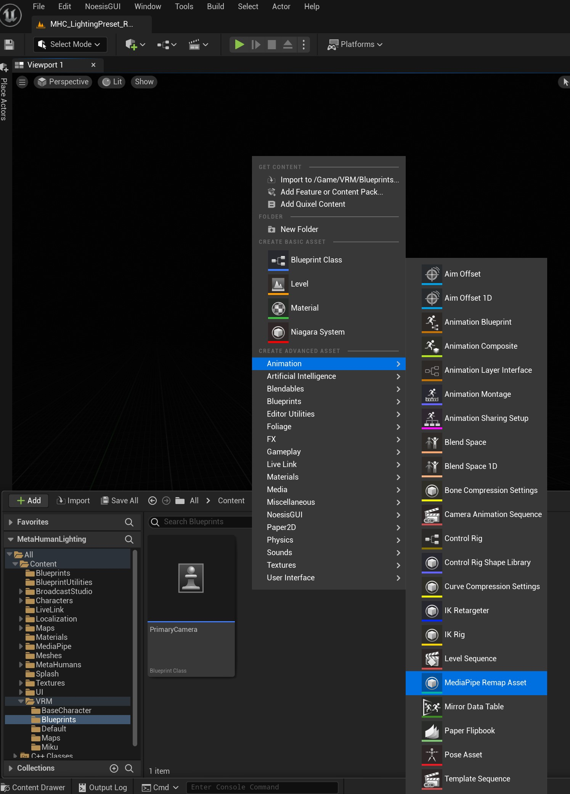
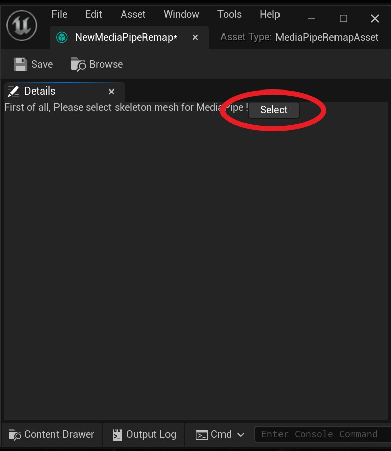
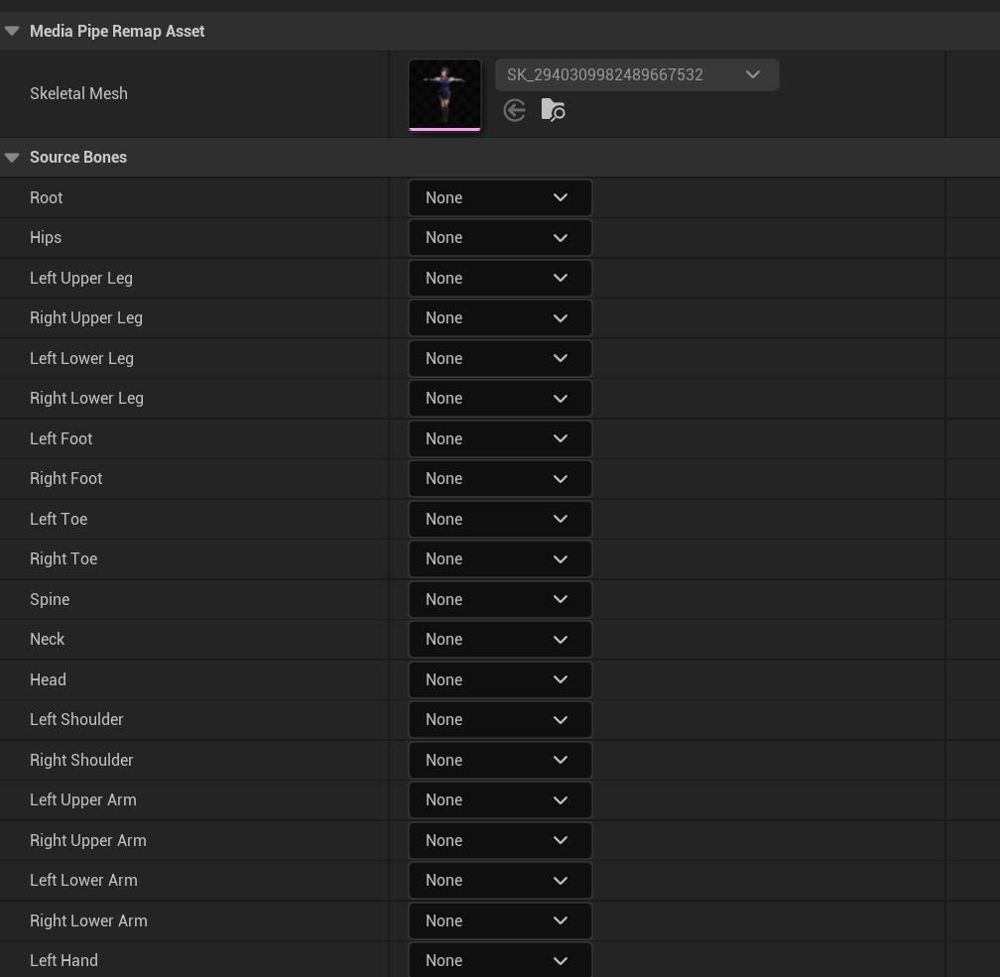
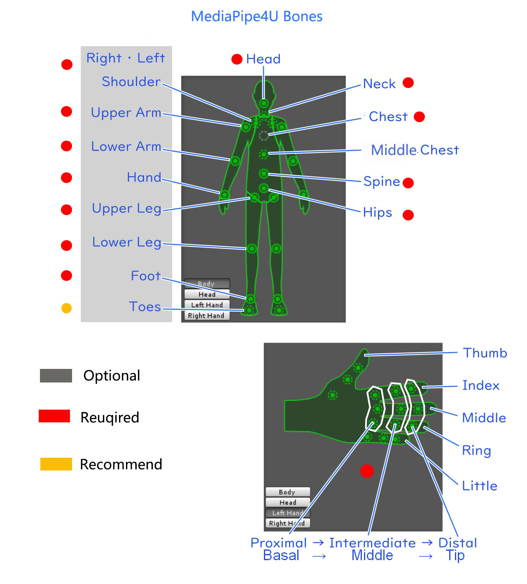
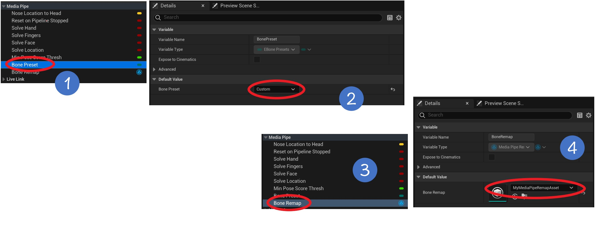

# Custom Skeletons

MediaPipe4U provides the following skeleton presets, which can begin motion capture without manual mapping:   

- UE5: The UE5 Mannequin skeleton, also compatible with the UE4 Mannequin and Metahuman
- VRoid (VRM): VRM model skeletons created with VRoid Studio
- CharacterCreator: Standard CharacterCreator 3/4 character skeletons
- Daz: Standard Daz character skeletons

If your skeleton is not one of the presets, this section explains how to map any skeleton.    

>Before reading this section, read [Quick Start](./quick_start.md). This section assumes that you have configured the Animation Blueprint nodes by following [Prepare the Motion-Capture Character](./quick_start.md/#_3).    

------   

## Create a MediaPipe Remap Asset

Right-click any folder in the Content Browser ---> `MediaPipe4U` --> `MediaPipe Remap`
> You can also click the Add button in the upper-left corner of the Content Browser to open the New Asset menu.



This creates a RemapAsset. Double-click it to open an empty editor window. Because remap assets are bound to skeletal meshes, first specify the skeletal mesh that MediaPipe4U will drive:
click Select and choose a skeletal mesh.




After selecting a skeleton, the editor displays the bone-binding list. Map the bones required by **MediaPipe4U** to bones in your skeletal mesh.



The following image shows the reference bone positions:   



Save the asset after completing the bone mapping. You now have a bone-remapping table that **MediaPipe4U** can drive.    


## Configure Mapping in the Animation Blueprint

Configure the remap asset in the Animation Blueprint as follows:
1. Set the Animation Blueprint variable `BonePreset` to **Custom**.
2. Set the Animation Blueprint variable `BoneRemap` to the MediaPipe remap asset you created.




> The Animation Blueprint must inherit from `MediaPipeAnimInstance`, and inherited variables must be visible. See [Prepare the Motion-Capture Character](prepare_character.md).

Save and compile the Animation Blueprint to begin MediaPipe motion capture.

## :bulb:Notes

Your arms (**Arm**) and legs (**Leg**) should use three-section bone chains. Otherwise, the plugin's **twist correction** and **IK** features (ArmIK and LegIK on the PoseSolver Animation Blueprint node) may not work correctly.   
Using an arm as an example:

**Correct arm-bone hierarchy:**   
> LeftUpperArm - LeftLowerArm - LeftHand
```
└─LeftUpperArm
    └─LeftLowerArm
        └─LeftHand
```
or   

> LeftUpperArm - LeftLowerArm2 - LeftHand   
> 
```
└─LeftUpperArm
    └─LeftLowerArm1
    └─LeftLowerArm2
          └─LeftHand
```

**:o:Incorrect arm-bone hierarchy:**     
> LeftUpperArm - LeftLowerArm1 - LeftLowerArm2 - LeftHand
```
└─LeftUpperArm
    └─LeftLowerArm1    (the arm has four sections)
       └─LeftLowerArm2
          └─LeftHand
```
