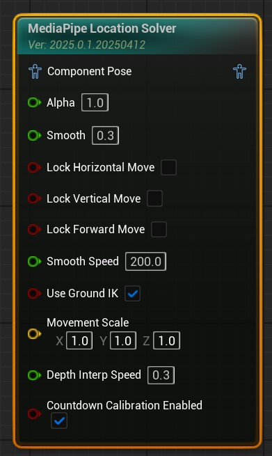
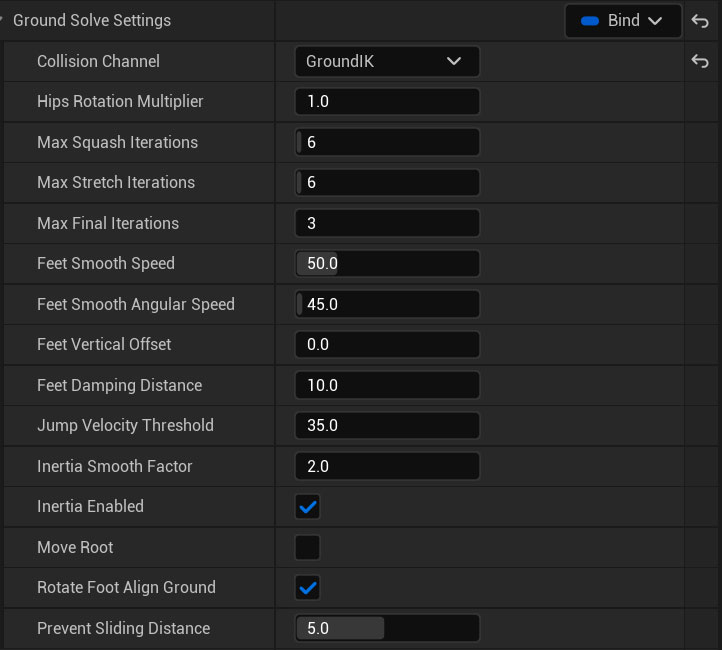
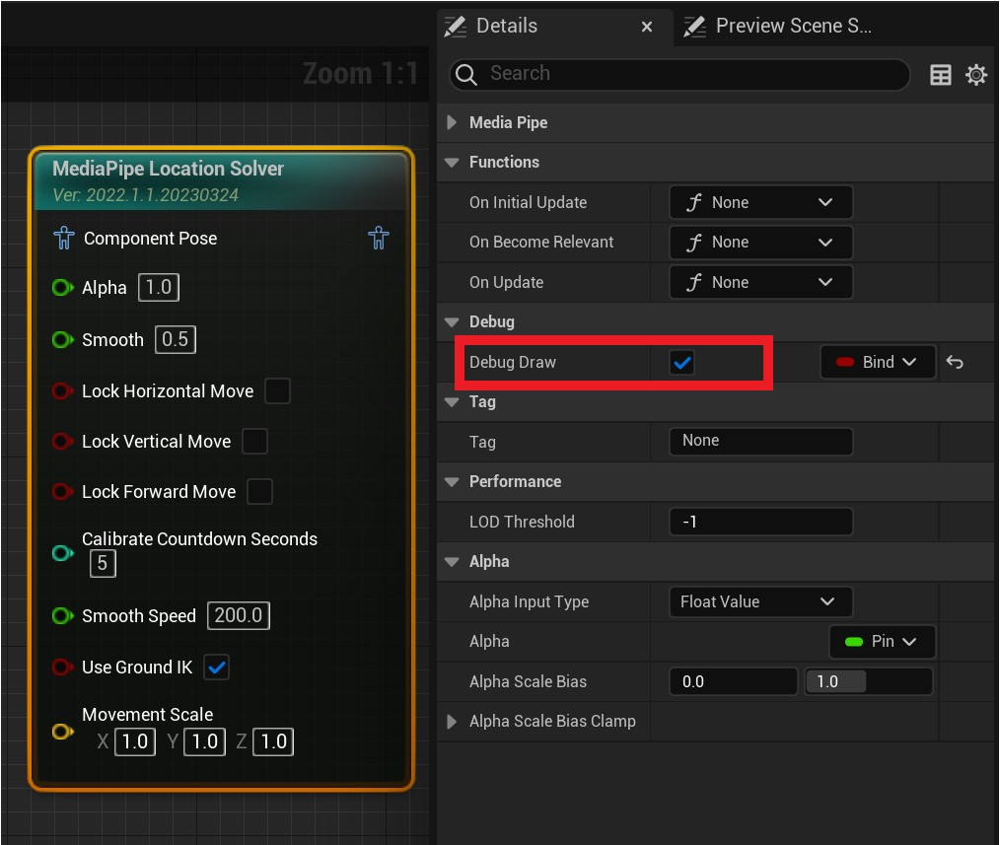
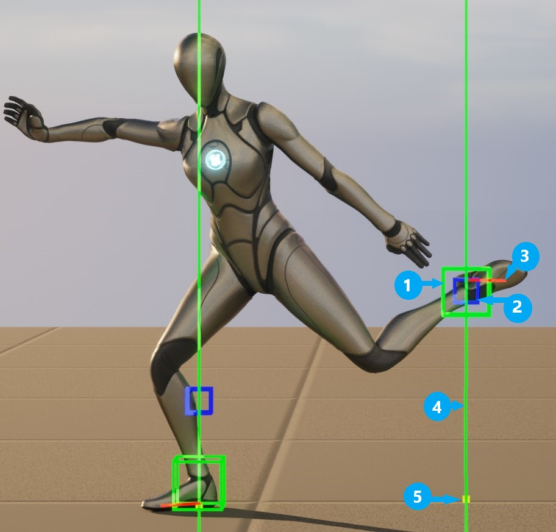

# Location Solver Node

MediaPipe4U uses the `MediaPipeLocationSolver` Animation Blueprint node to calculate character translation from motion-capture data.

!!! tip

    Moving the character moves its root bone, the first bone in the hierarchy.

    `MediaPipeLocationSolver` requires location calibration before it can work.

## Install the Node

1. Add `MediaPipeLocationSolver` to the Animation Blueprint.
2. Configure its primary behavior on the node.
3. Select the node and configure details in the Details panel.

MediaPipe4U now calculates subject translation and moves the 3D character on the X, Y, and Z axes.   
   

The following settings adjust location solving. The main concerns are movement-axis control, speed, and ground alignment. Many other properties are shared by all MediaPipe4U nodes through their base class.

## Basic Parameters   

These commonly used properties cover most scenarios.

|Property| Default | Description |
|--------------------| ------ | -- |
| Smooth | 0.3 | Smoothing applied to capture data, from 0 to 1. Higher values are smoother. |
|LockHorizontalMove| false | When **true**, prevents horizontal left/right movement. |
|LockVerticalMove| false | When **true**, prevents vertical up/down movement. |
|LockForwardMove| false | When **true**, prevents forward/backward movement. |
|UseGroundIK| true | Whether to use Ground IK, described below. |
|SmoothSpeed| 200 | Movement smoothing speed in centimeters per second, preventing excessive movement when video changes suddenly. 0 means unlimited. |
|DepthInterpSpeed| 0.5 | Rate at which the estimated subject-to-camera distance changes. This affects depth calculation and normally needs no adjustment. |
|MovementScale| Vector(1,1,1) | Scales translation on three axes. For a character facing Y, X is horizontal, Y is forward/backward, and Z is vertical. |
|CountdownCalibrationEnabled| true | Whether to calibrate location when the countdown ends. |

## Location Calibration

If `CalibrationPolicy` on `MediaPipeAnimInstance` is **Manual** (the default), you **must** call `CalibrateLocation` on `MediaPipeAnimationInstance` before the location solver works.

With **CountdownOnStart**, capture automatically starts a countdown and captures one video frame as the position reference when it ends.   

> With **CountdownOnStart**, set the duration through `CalibrateCountdownSeconds`.       

!!! tip

    MediaPipe4U supports two location-calibration modes:   

    1. `Countdown`: after a countdown, automatically capture a frame from the image source for calibration.
    2. `Manual`: call `CalibrateLocation` on `MediaPipeAnimationInstance` to capture the current frame manually.   
      
    Use `CountdownCalibrationEnabled` on `MediaPipeLocationSolver` to control automatic countdown calibration.     

:page_with_curl: For more information, read [Calibration](./calibration.md).   

---   

## Ground IK

A monocular camera cannot accurately obtain depth. MediaPipe4U's calibration-free design also lacks camera intrinsics and a rotation matrix, so pixel coordinates cannot be mapped directly to spatial coordinates and character location may drift.
Vertical drift can make the character float or sink into the ground. The built-in Ground IK solver aligns the feet with the ground. 

!!! tip

    Ground IK is not a universal solution and cannot guarantee perfect results.

The easiest way to get started is to watch a tutorial:   

- [Chinese video (bilibili)](https://www.bilibili.com/video/BV1eY4y1Q7AD)
- [English video tutorial (YouTube)](https://youtu.be/cop7_kCaDn4)
   

### How Ground IK Works

- Casts rays toward the ground
- Calculates foot-to-ground distance from each foot bone
- Moves the pelvis to eliminate that distance
- Applies IK to the thigh-to-ankle chain for a natural pose

!!! warning

    Ground IK uses ray traces and rays from the legs must collide only with the ground. Create a dedicated Collision Channel that ignores all other collision, especially the Character capsule. See Unreal Engine collision-channel documentation.   

Select the location solver node and adjust Ground IK in Details.

Most defaults are reasonable. Usually, adjust only:

- FeetDampingDistance
- JumpVelocityThreshold
- FeetSmoothSpeed
- PreventSlidingDistance

### Complete Parameter Reference

#### MoveRoot   
Ground IK moves the pelvis by default. Set this to true to move the root bone instead.
Default: **false**      

#### RotateFootAlignGround   
Whether to rotate ankles to align feet with the ground. Disable this when inappropriate, for example with high heels.   
Default: **true**      

#### FeetRollSmooth   
Ankle Roll smoothing from 0 to 1; higher values are smoother.   
Default: 0.6

#### FeetPitchSmooth   
Ankle Pitch smoothing from 0 to 1; higher values are smoother.   
Default: 0.8

#### CollisionChannel      
Collision channel used for ray traces. Ensure foot rays collide only with the ground.   

#### HipsRotationMultiplier      
Controls slight pelvis rotation when the surface normal changes as the pelvis moves.

#### MaxSquashIterations     
Leg IK iterations when pelvis movement compresses the legs.

#### MaxStretchIterations      
Leg IK iterations when pelvis movement stretches the legs.

#### FeetSmoothSpeed       
Incremental nonlinear speed, in centimeters per second, used when moving a Foot bone toward the ground. Decrease it if lifting or lowering is too fast; increase it if too slow.

#### FeetSmoothAngularSpeed       
Incremental angular speed, in degrees per second, used when rotating a Foot bone to align with the ground.

#### FeetDampingDistance       
Foot-lift damping height in centimeters. Below this height, the foot remains attached to the ground. Smaller values make lifting more sensitive. Decrease it if the foot cannot lift; increase it if the foot lifts unexpectedly.

#### JumpVelocityThreshold       
Jump-velocity threshold in centimeters per second. Only movement above this value is treated as jumping, gradually reducing foot damping for takeoff. Lower values are more sensitive to small jumps. Increase it if the character often leaves the ground; decrease it if the character cannot jump.

#### InertiaSmoothFactor       
Inertia-smoothing factor used to remove movement oscillation through incremental nonlinear damping. Higher values provide more smoothing.

#### FeetVerticalOffset        
Static vertical foot offset in centimeters. Use it when IK leaves feet sunk or floating, possibly because the modeled feet and root bone are not coplanar. Positive values push upward; negative values push downward.

#### bRotateFootAlignGround        
Whether to rotate ankles so soles align with the ground.
Default: true 

#### MoveRoot        
Ground IK moves the pelvis by default to remove floating or sinking. Set true to move the root bone instead; not recommended.
Default: false

#### PreventSlidingDistance    
Distance in centimeters within which foot sliding is suppressed as much as possible.
Default: 5

## Debug Drawing

Ray-collision or foot-position issues can cause Ground IK failure. Enable `DebugDraw` to display key solving points.

1. Select MediaPipe Location Solver in the Animation Blueprint.
2. Enable **DebugDraw** in Details.
3. Run the application and start motion capture.

!!! tip

    If `DebugDraw` on `MediaPipeAnimationInstance` is **false**, node-level `DebugDraw` has no effect.

After capture starts:

Annotations:

1. Green box: Foot-bone position after Ground IK.
2. Blue box: Foot-bone position before Ground IK.
3. Short red line: horizontal sole plane, which should be parallel to the ground.
4. Ground-detection ray: **green** means a hit; **red** means no hit.
5. Yellow point: ray-hit location, normally on the ground.
