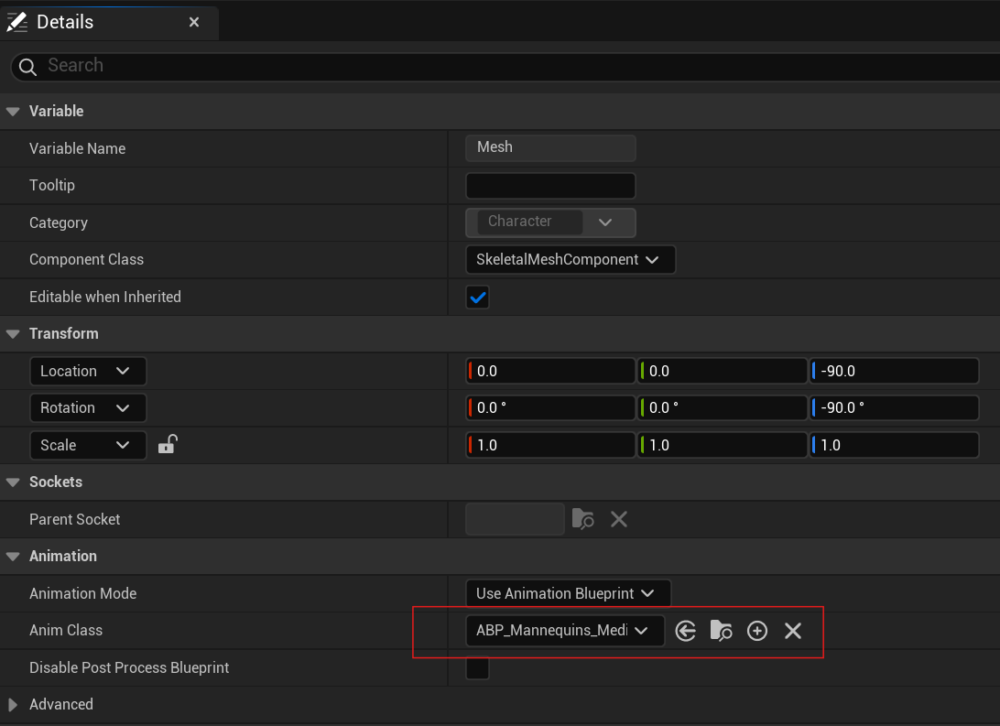

# MediaPipe Animation Blueprint

## Overview

`MediaPipeAnimInstance` is the Animation Blueprint base class for `MediaPipe4U` motion capture. It continuously receives MediaPipe data from `MediaPipeHolisticComponent`
and applies that data to MediaPipe4U Animation Blueprint nodes.

When `Anim Class` on a skeletal mesh (`USkeletalMeshComponent`) is set to an Animation Blueprint derived from `MediaPipeAnimInstance`, MediaPipe4U drives that mesh.

{ align=right }

> `MediaPipeAnimInstance` is part of the `MediaPipe4UMotion` plugin and is a core motion-capture component.

## Properties

`MediaPipeAnimInstance` provides many properties that control animation behavior.

> In the Animation Blueprint asset editor viewport, open `Class Defaults` and edit these properties in Details.
> 
> { align=right }
> 

|Property    | Type  | Default | Description     |
|--------|--------|--------|--------|
|Mode| enum | | Full-body or upper-body animation mode. |
|ResetOnPipelineStopped| bool | true | Whether to reset to the initial pose when capture stops, for example when `MediaPipeHolisticComponent::Stop` is called. |
|SolveFingers| bool | true | Whether to solve fingers. Finger capture calculates wrist rotation from finger positions and requires clearly visible fingers. |
|SolveHeadFromFaceMesh| bool | false | Whether to calculate head rotation from facial landmarks. Requires a clearly visible face and a `MediaPipeHeadSolver` node. |
|SolveLocation| bool | true | Whether to solve location/translation. When **true**, a `MediaPipeLocationSolver` node is also required. |
|MinPoseScoreThresh| float | 0.5 | Confidence threshold for pose landmarks. A landmark is used to calculate joint rotation only above this value. |
|MinHandScoreThresh| float | 0.5 | Confidence threshold for hand landmarks. A landmark is used only above this value. |
|MinFaceScoreThresh| float | 0.5  | Confidence threshold for facial landmarks. A landmark is used for head rotation only above this value. Effective only with `SolveHeadFromFaceMesh`. |
|TwistCorrectionEnabled| bool | false | Whether to perform joint twist correction. See the twist-correction documentation. |
|AutoConnectToMediaPipe| bool | Enabled | Controls automatic MediaPipe connection. When **Disabled**, the Animation Blueprint does not automatically connect for data; call a `ConnectToMediaPipe` function manually. |
|LiveLinkSubject| FLiveLinkSubjectName | MediaPipe4U | Convenience property for LiveLink integration. MediaPipe4U does not use it; your Blueprint can use it to switch LiveLink connections. |
|LiveLinkEnabled| bool | true | Convenience property for LiveLink integration. MediaPipe4U does not use it; your Blueprint can use it to control LiveLink. |
|bDebugDraw| bool | false | Whether to draw debug information on the skeletal mesh. |
|CalibrationCountdownSeconds| float | 5 | Calibration countdown duration in seconds; see calibration documentation. |
|CalibrationPolicy| enum | Manual | Calibration policy: `CountdownOnStart`: count down when MediaPipe starts; `Manual`: call calibration functions manually. |
|BonePreset| enum | UE5 | Built-in or custom skeleton preset. |
|BoneRemap| MediaPipeRemapAsset asset | null | With **Custom** `BonePreset`, supplies skeleton mapping information. |
|PoseAsset| PoseAsset asset | `null` | PoseAsset used to correct the initial pose. For example, straighten the default UE5 character's bent fingers. |
|PoseForInit| Name | None | Name of the initial pose (curve) in the PoseAsset assigned to `PoseAsset`. |

## Blueprint Functions

|Function    | Description     |
|----------|--------------------|
|IsMediaPipeRunning| Whether MediaPipe solving is running.|
|IsPaused| Whether MediaPipe solving is paused.|
|Pause| Pauses MediaPipe solving.|
|Resume| Resumes MediaPipe solving.|
|ConnectToMediaPipeInLevel| 
Connects(1) `MediaPipeAnimInstance` to `MediaPipeHolisticComponent` in the Level.
1. :man_raising_hand: A connection means the Animation Blueprint obtains MediaPipe data from the target for solving.|
|ConnectToMediaPipe| 
Connects(1) `MediaPipeAnimInstance` to a specified `MediaPipeHolisticComponent`.
1. :man_raising_hand: A connection means the Animation Blueprint obtains MediaPipe data from the target for solving.|
|IsMediaPipeConnected| Whether the Animation Blueprint is connected to `MediaPipeHolisticComponent`.|
|DisconnectFromMediaPipe| Disconnects from `MediaPipeHolisticComponent`.|
|LoadBoneSettingsFromJsonContent| Loads custom skeleton mapping (`BoneRemap`) from a JSON string.|
|LoadBoneSettingsFromJsonFile| Loads custom skeleton mapping (`BoneRemap`) from a JSON file.|
|CalibratePose| Calibrates pose. |
|UnCalibratePose| Resets pose calibration. |
|CalibrateLocation| Calibrates location. |
|UnCalibratePose| Resets location calibration. |
|GetCalibrationRemainingSeconds| Gets remaining calibration-countdown seconds. |
|StartCalibrationCountdown| Starts a calibration countdown with a specified duration; pose and location are calibrated when it ends. |
|CancelCalibrationCountdown| Cancels an active calibration countdown. |
|GetSolverFPS| Gets solver FPS, usually for measuring performance. |

!!! warning

    `MediaPipeLocationSolver` begins working only after location calibration completes.

## C++ Functions

C++ functions provide lower-level functionality than Blueprint functions.

|Function    | Description     |
|----------|--------------------|
|GetLocationSolver|Gets the location solver.|
|GetPoseSolver|Gets the pose solver.|
|GetHandsSolver|Gets the hand/finger solver.|
|GetHeadSolver|Gets the head solver.|
|GetGroundIKSolver|Gets the Ground IK solver.|
|LoadBoneSettings| Loads skeleton mapping from a C++ `IBoneSettingsProvider`.|
