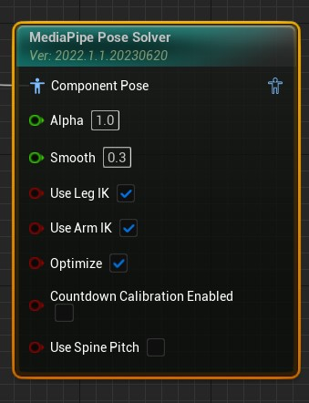
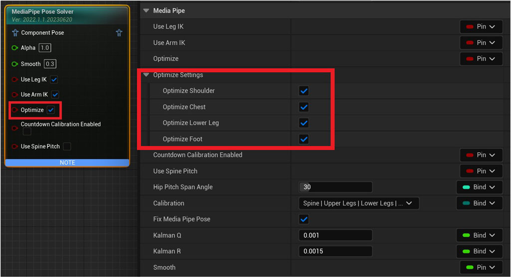
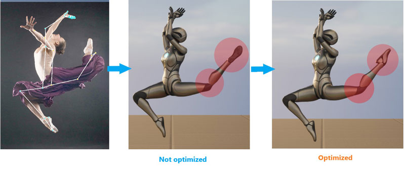
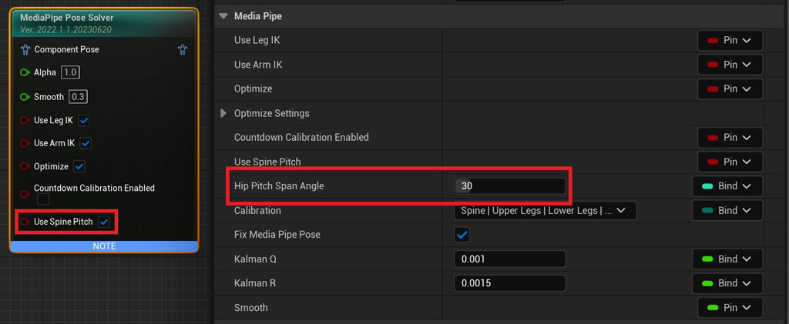
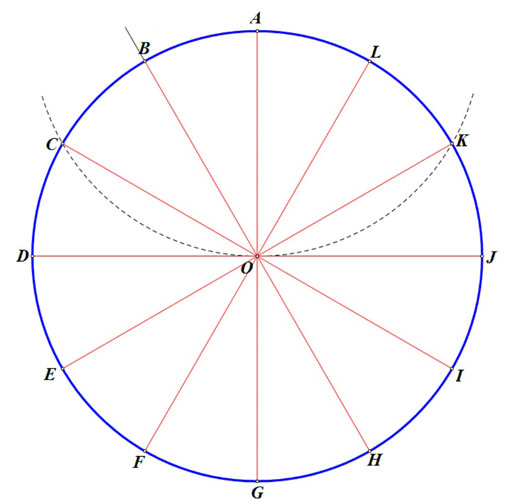
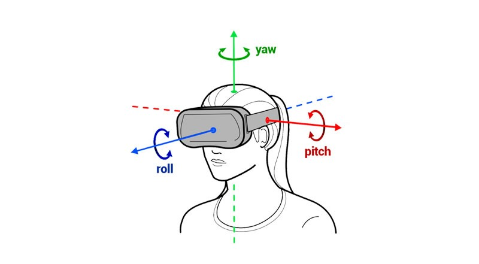

# Pose Solver Node

MediaPipe4U uses the `MediaPipePoseSolver` Animation Blueprint node to calculate character-joint rotations from capture data and synchronize the subject's pose with a 3D character.

## Install the Node

1. Add `MediaPipePoseSolver` to the Animation Blueprint.
2. Configure its primary behavior.

MediaPipe4U calculates joint rotations and drives the 3D character into a pose approximating the subject.

## Parameters

|Parameter|Type|Description|
|---|----|-----|
|Alpha| float (0-1.0)| Same as Alpha on standard Animation Blueprint nodes.|
|Smooth| float (0-1.0)| Motion smoothing. Higher values reduce jitter but lower responsiveness. Use lower values for fast motion and higher values for slow sources.|
|LockArms| bool | Locks the chain from upper arms to hands. When **true**, Shoulder, UpperArm, LowerArm, and Hand do not participate.|
|LockLegs| bool | Locks the chain from thighs to feet.|
|LockHips| bool | Locks the pelvis, usually the root, preventing whole-body rotation.|
|LockSpine| bool | Locks the spine, preventing upper-body rotation.|
|LockChest| bool | Locks the chest. **Note**: LockSpine also locks the chest.|
|LockHead| bool | Locks the head.|
|LockHand| bool | Locks wrists and fingers. **Note**: LockArms also locks hands.|
|LockElbow| bool | Locks elbows. **Note**: LockArms also locks elbows.|
|LockKnee| bool | Locks knees. **Note**: LockLegs also locks knees.|
|LockFoot| bool | Locks ankles. **Note**: LockLegs also locks ankles.|
|UseLegIK| bool | Uses leg IK to correct knee twisting. Normally enabled, though motion may be less exact.|
|UseArmIK| bool | Uses arm IK to correct elbow twisting. Normally enabled, though motion may be less exact.|
|KalmanQ| float | Kalman filter Q; do not change unless familiar with Kalman filtering.|
|KalmanR| float | Kalman filter R; do not change unless familiar with Kalman filtering.|
|Optimize| bool | Whether to perform additional optimization.|
|CountdownCalibrationEnabled| bool | Defaults to **false**; whether to calibrate pose when the countdown ends.|
|Calibration| PoseCalibrationFlags | Joints included during calibration.|
|UseSpinePitch| bool | Whether to use spine pitch rotation.|
|HipPitchSpanAngle| int | Angle from 0 to 180 controlling pelvis-rotation intervals.|
|bFixMediaPipePose|bool|Whether to correct details in raw MediaPipe capture data.|
|UpperBodyLocks| struct | Locks upper-body pitch, yaw, and roll.|
|TwistCorrectionSettings| struct | Joint twist-correction weights.|

## Arm IK

With UseArmIK enabled, TwoBone IK drives the arm from upper arm to wrist instead of directly rotating bones, primarily preventing elbow twisting. If the pose is already good without Arm IK, disable it for a pose closer to the source.

## Leg IK

With UseLegIK enabled, TwoBone IK drives the leg from thigh to ankle instead of directly rotating bones, primarily preventing knee twisting. If the pose is already good without IK, disable it for a pose closer to the source.

## Pose Calibration

Image-based tracking can bend knees or the spine because of vision-algorithm limitations. MediaPipe4U therefore provides initial-pose calibration.    
By default, a countdown starts with capture and calibrates body joints when it ends.
> Set the duration with `CalibrateCountdownSeconds` on `MediaPipeAnimationInstance`.   

!!! tip

    MediaPipe4U supports two pose-calibration modes:   

    1. `CountdownOnStart`: start a countdown with capture and calibrate automatically at its end.
    2. `Manual`: call `CalibratePose` on `MediaPipeAnimationInstance` manually.  
      
    Set `CountdownCalibrationEnabled` on Pose Solver to control whether countdown completion performs pose calibration. 
     
:page_with_curl:For more information, read [Calibration](./calibration.md).

## Adjust Joint Locks

!!! tip

    Dynamically changing joint locks invalidates pose calibration.

    Recalibrate manually after changing locks at runtime; see [Calibration](./calibration.md).

## Pose Optimization

Capture accuracy, occlusion, and IK can produce imperfect details. Set Optimize to **true** to improve them and use **Optimize Settings** to select optimizations:

Current and planned optimizations:

- [x] Ankle rotation correction
- [x] Knee pole-vector correction
- [x] Shoulder-motion compensation
- [x] Foot rotation correction 

> New optimizations are added over time; enabling optimization is recommended.

Extreme-pose comparison after optimization:

!!! tip

    Optimize adjusts unreasonable joint rotations. Disable it if it causes pose problems.

## Spine Rotation Mode (Beta)

By default, MediaPipe4U rotates the body through the pelvis. Pelvis rotation affects the whole body and capture jitter may cause unstable ankles. Spine rotation mode greatly improves this:   

1. Enable UseSpinePitch on Pose Solver.
2. Set an appropriate HipPitchSpanAngle for the model.

**Meaning of HipPitchSpanAngle:**   

Pelvis Pitch ranges from -180 to 180 degrees. HipPitchSpanAngle divides it into steps; for example, 30 degrees:

Pelvis rotation changes only at specific steps such as 0, 30, 90, 120, 150, 180, -30, -90, -120, and -150; the spine supplies remaining rotation. This reduces pelvis changes and stabilizes ankles. Example for 0-180 degrees:

|Body Pitch| Pelvis Angle | Spine Angle |
|------ | -- |----- |
|0 - 29 | 0 | 0- 29 |
|30 - 59 | 30 | 0- 29 |
|60 - 89 | 60 | 0- 29 |
|90 - 119 | 90 | 0- 29 |
|120 - 179 | 120 | 0- 29 |
|180 | 180 | 0 |

!!! warning

    Spine rotation mode is a **beta** feature. Disable it if it causes problems.
    
    Skeleton designs differ; tune the span for your model.   
    
    Incorrect spans can twist the spine. Smaller spans reduce twisting but increase pelvis switching and foot instability; larger spans improve foot stability.

## Upper-Body Locks

Use UpperBodyLocks on Pose Solver to lock any of the upper body's three axes.   

The axes are defined as follows:   

