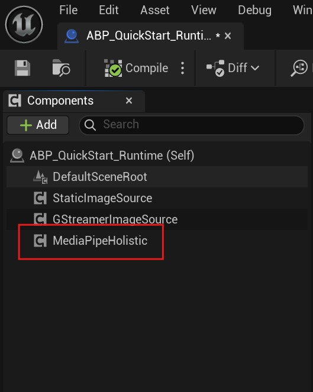
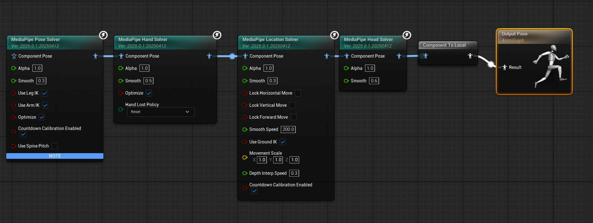
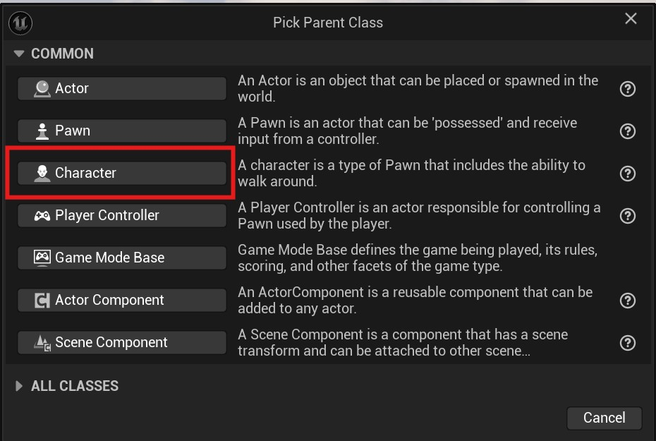
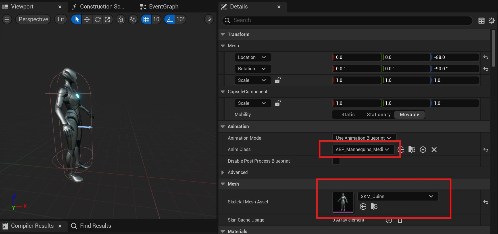
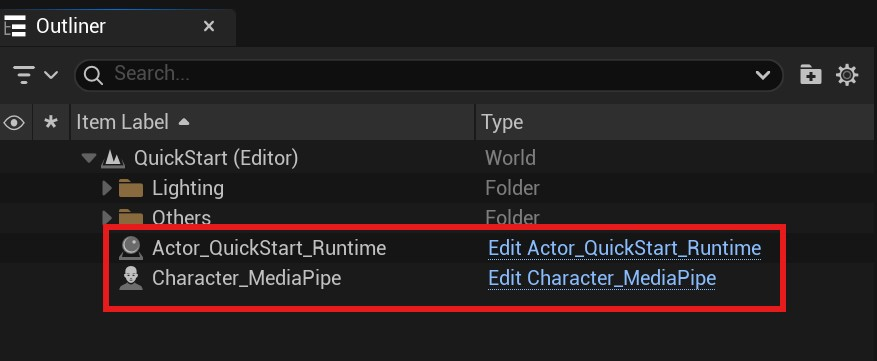
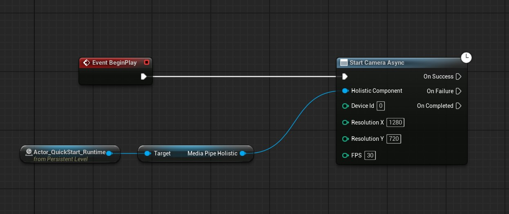
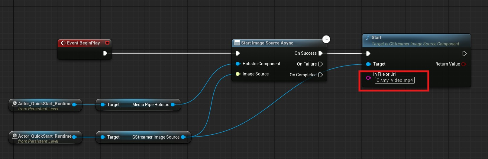
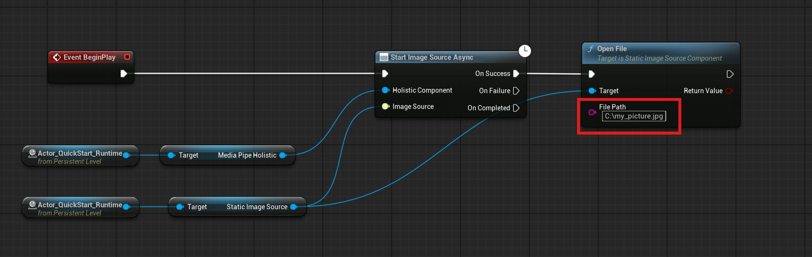

# Quick Start

Using MediaPipe4U for motion capture requires only three steps:

1. Prepare runtime components: create an Unreal Engine `Actor` containing the runtime components.
2. Prepare a motion-capture character: create an Unreal Engine `Character` to display the animation.
3. Start motion capture: create a Blueprint that starts the motion-capture program.

If your Unreal Engine project is ready and MediaPipe4U is installed, this tutorial takes only about 3-5 minutes.

## Prepare Runtime Components

Create an **Actor** and add `MediaPipeHolisticComponent`.   

This example names the Actor `Actor_QuickStart_Runtime`.   
Add these components:   

- `MediaPipeHolisticComponent`: core motion-capture algorithm component
- `StaticImageSourceComponent`: optional; captures motion from a single image
- `GStreamerImageSourceComponent`: optional; captures motion from a video file

The completed `Actor_QuickStart_Runtime` should look like this:

## Prepare the Motion-Capture Character

### Create an Animation Blueprint

Create an **Animation Blueprint** with `MediaPipeAnimInstace` as its base class and use Unreal Engine 5's built-in `SK_Mannequin` as its skeletal mesh.  

This example names it `ABP_Mannequins_MediaPipe`.

Open it and add these Blueprint nodes in order:

- `MediaPipePoseSolver`: pose solver
- `MediaPipeHandSolver`: hand/finger solver
- `MediaPipeLocationSolver`: location/translation solver
- `MediaPipeHeadSolver`: head solver

Save and compile the Animation Blueprint.

### Create a Character

Create a **Blueprint** based on `Character`; this example names it `Character_MediaPipe`.

Open `Character_MediaPipe`, select Class Defaults, choose the `Skeletal Mesh` asset in Details, and set `Anim Class` to `ABP_Mannequins_MediaPipe`.

Save and compile the Character Blueprint.

## Start Motion Capture

### Create a Level

Create a Level named `QuickStart` in this example.

Place these Blueprints in the Level:

- `Character_MediaPipe`: motion-capture Character.
- `Actor_QuickStart_Runtime`: runtime-component Actor.

### Edit the Level Blueprint

Open the Level Blueprint and add the following nodes.

Save and compile the Level Blueprint.

### Run the Level

Run the Level. It opens the camera and drives the 3D character with captured human motion.

## Capture Motion from a Video File

Modify the Level Blueprint to use `GStreamerImageSourceComponent`.

Save and compile, then rerun the Level to capture motion from `C:\my_video.mp4` and drive the character.

## Capture Motion from an Image File

Modify the Level Blueprint to use `StaticImageSourceComponent`.

Save and compile, then rerun the Level to capture motion from `C:\my_picture.jpg` and drive the character.
