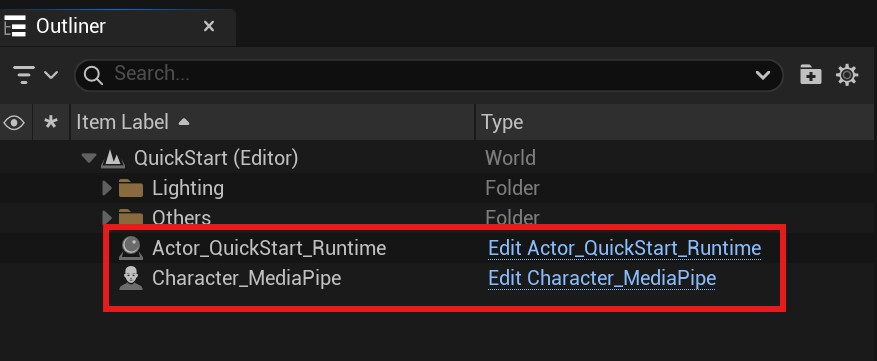
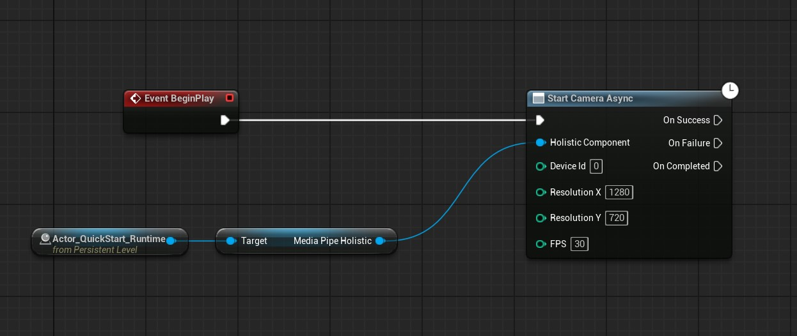
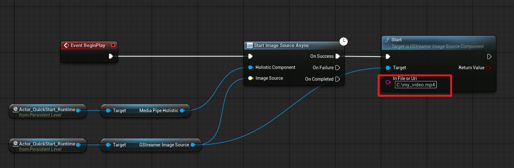

# 快速入门

使用 MediaPipe4U 进行动作捕捉，你只需要一下三个步骤：

1. 准备运行时组件：创建一个 Unreal Engine 的 `Actor` 放置运行时组件。
2. 准备动补角色：准备一个用于展示动画的角色 (一个 Unreal Engine 的 `Character`)。
3. 开始动补：创建一个蓝图来开始运行动作捕捉程序。

如果你已经创建好 Unreal Engine 项目，并下载和安装好 MediaPipe4U 插件，下面的教程只需要至多花你 3~5 分钟，即可快速完成这个过程。

## 准备运行时组件

创建一个 **Actor** 并在 Actor 中添加 `MediaPipeHolisticComponent`。   

这个例子中 Actor 名称为 `Actor_QuickStart_Runtime`。   
在 `Actor_QuickStart_Runtime` 中添加如下组件:   

- `MediaPipeHolisticComponent`: 动作捕捉算法的核心组件
- `StaticImageSourceComponent`: （可选） 可以从单张图片中捕捉动作
- `GStreamerImageSourceComponent`: （可选） 可以从视频文件中捕捉动作

完成这一步操作后，添加后 Actor (`Actor_QuickStart_Runtime`) 看起来应该如下图:

## 准备动补角色

### 创建动画蓝图

创建一个**动画蓝图**，基类选择 `MediaPipeAnimInstace`, 使用 UnrealEngine 5 内置的 `SK_Mannequin` 作为这个动画蓝图的骨骼网格体  

这个例子中我们将这个动画蓝图命名为 `ABP_Mannequins_MediaPipe`。

打开创建好的动画蓝图，在蓝图编辑器中依次加入如下蓝图节点（注意顺序）:

- `MediaPipePoseSolver`: 姿态算解节点
- `MediaPipeHandSolver`: 手部（手指）算解节点
- `MediaPipeLocationSolver`: 位置（位移）算解节点
- `MediaPipeHeadSolver`: 头部算解节点

[ABP_Mannequins_MediaPipe](./images/quick_start/anim_blueprint_graph.jpg "ABP_Mannequins_MediaPipe")

保存并编译这个动画蓝图。

### 创建 Character

创建一个**蓝图**，基类选择 `Character`， 这个例子中我们命名为 `Character_MediaPipe`。

打开 `Character_MediaPipe` 编辑器，选择类定义 (Class Defaults), 并在细节面板中选择正在网格资产 (`Skeletal Mesh`) 资产，并将动画蓝图类（`Anim Class`）设为我们刚才创建的 `ABP_Mannequins_MediaPipe`。

保存并编译这个 Character 蓝图。

## 开始动作捕捉

### 创建关卡

创建一个关卡 (Level)，这个例子中我们命名为 `QuickStart`。

在关卡中放入刚才创建的蓝图：

- `Character_MediaPipe`： 动补角色 （Character）。
- `Actor_QuickStart_Runtime`: 运行时组件 （Actor）。

### 编辑关卡蓝图

现在打开关卡蓝图 (Level Blueprint) ，在蓝图便器中添加如下节点。

保存并编译关卡蓝图。

### 运行管卡

现在运行这个关卡，将会打开摄像头，并从摄像头中捕获人物运动来驱动你的 3D 角色。

## 从视频文件中捕捉动作

### 编辑关卡蓝图

调整管卡蓝图， 使用 `GStreamerImageSourceComponent` 来从视频文件中捕捉动作。

保存并编译关卡蓝图，然后重新运行关卡，将从 `C:\my_video.mp4` 视频文件中捕获动作，并驱动你的 3D 角色。

## 从图片文件中捕捉动作

### 编辑关卡蓝图

调整管卡蓝图， 使用 `GStaticImageSourceComponent` 来从图片文件中捕捉动作。

保存并编译关卡蓝图，然后重新运行关卡，将从 `C:\my_picture.jpg` 图片文件中捕获动作，并驱动你的 3D 角色。