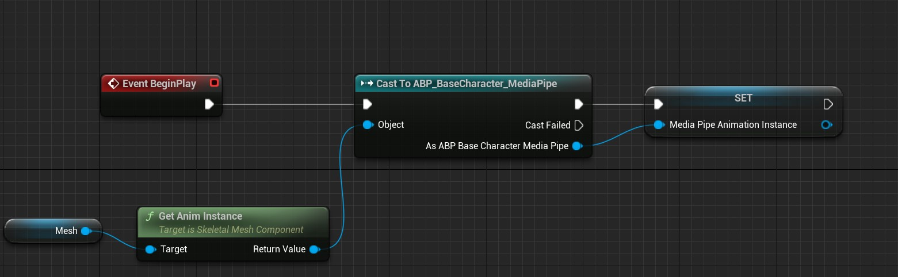
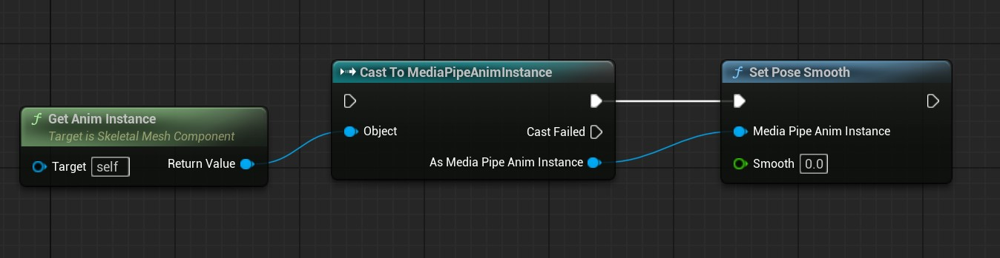
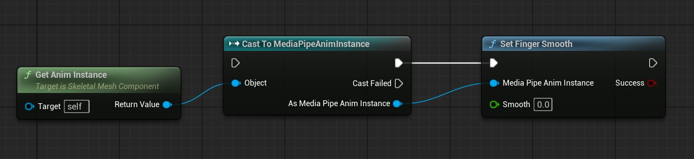
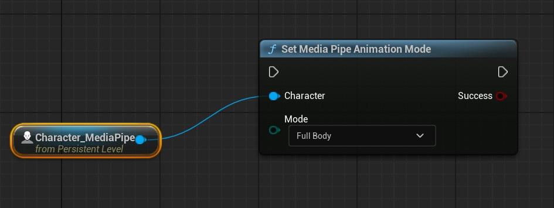
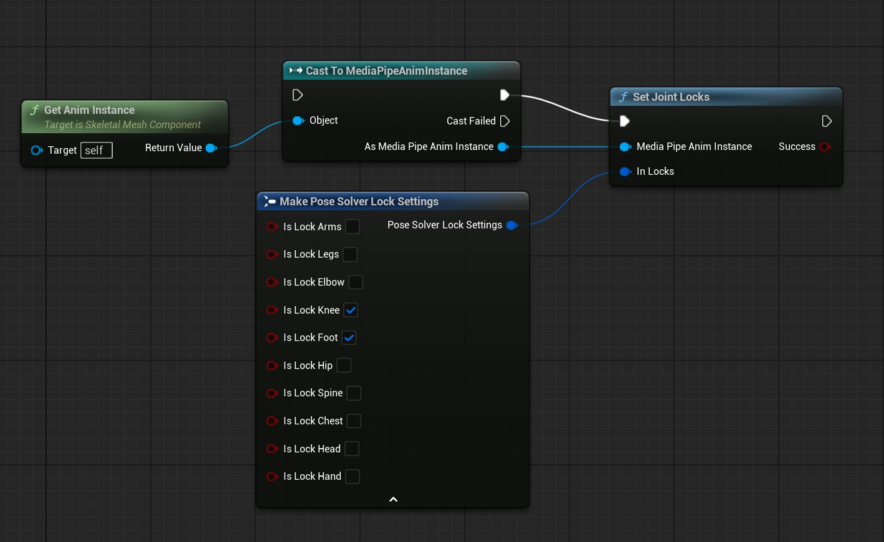
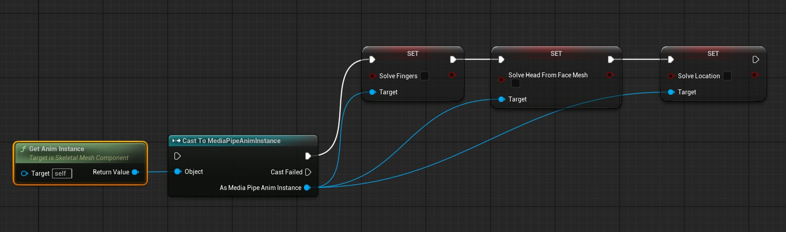
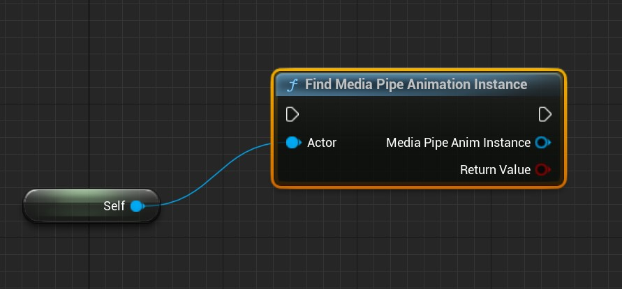

# Runtime Control

MediaPipe4U lets you dynamically adjust smoothing, filters, joint locks, and other parameters at runtime.   
MediaPipe4U is written in **C++**, giving C++ projects maximum flexibility. Blueprint projects can use the `UMediaPipeMotionUtils` function library, which will continue to gain practical features.

## Get MediaPipeAnimInstance

=== "Blueprint"

    Suppose an Animation Blueprint named **ABP_BaseCharacter_MediaPipe**, based on `MediaPipeAnimInstance`, is assigned to a Character's skeletal mesh named mesh.
    The Character Blueprint can retrieve ABP_BaseCharacter_MediaPipe as follows.

    

    > This Blueprint stores the `MediaPipeAnimInstance` in a variable named **MediaPipeAnimationInstance**.

=== "C++"

    ```c++
    if (Mesh)
	{
		UAnimInstance* anim = Mesh->GetAnimInstance()
		if(UMediaPipeAnimInstance* animInstance = Cast<UMediaPipeAnimInstance>(anim))
		{
			// use animInstance here...
		}
	}
    ```


## Change Body-Motion Smoothing

Use `UMediaPipeMotionUtils` to change body-motion smoothing:

=== "Blueprint"
    
    

=== "C++"

    ```c++

    UMediaPipeAnimInstance* animInstance = nullptr;
    if(UMediaPipeMotionUtils::FindMediaPipeAnimationInstance(MediaPipeCharacter, animInstance))
    {
        UMediaPipeMotionUtils::SetPoseSmooth(animInstance, Value);
    }

    ```

## Change Finger-Motion Smoothing

Use `UMediaPipeMotionUtils` to change finger-motion smoothing:

=== "Blueprint"
    
    

=== "C++"

    ```c++

    UMediaPipeAnimInstance* animInstance = nullptr;
    if(UMediaPipeMotionUtils::FindMediaPipeAnimationInstance(MediaPipeCharacter, animInstance))
    {
        UMediaPipeMotionUtils::SetFingerSmooth(animInstance, Value);
    }

    ```

## Change Finger-Motion Smoothing

`UMediaPipeMotionUtils` also lets you toggle solvers at runtime:

=== "Blueprint"
    
    

=== "C++"

    ```c++

    UMediaPipeAnimInstance* animInstance = nullptr;
    if(UMediaPipeMotionUtils::FindMediaPipeAnimationInstance(MediaPipeCharacter, animInstance))
    {
        UMediaPipeMotionUtils::SetFingerSmooth(animInstance, Value);
    }

    ```


## Switch Full-Body/Upper-Body Mode


`UMediaPipeMotionUtils` provides a convenient switch between upper-body and full-body capture. Upper-body mode locks leg and pelvis rotation.

=== "Blueprint"

    

=== "C++"

    ```c++

    UMediaPipeAnimInstance* animInstance = nullptr;
    if(UMediaPipeMotionUtils::FindMediaPipeAnimationInstance(MediaPipeCharacter, animInstance))
    {
        UMediaPipeMotionUtils::SetMediaPipeAnimationMode(animInstance, Value);
    }

    ```

## Lock Selected Joints


In addition to full-body/upper-body switching, `UMediaPipeMotionUtils` supports precise joint-lock control.

=== "Blueprint"

    

=== "C++"

    ```c++

    UMediaPipeAnimInstance* animInstance = nullptr;
    if(UMediaPipeMotionUtils::FindMediaPipeAnimationInstance(MediaPipeCharacter, animInstance))
    {
        FPoseSolverLockSettings settings;
        settings.bIsLockKnee = true;
        settings.bIsLockFoot = true;
        UMediaPipeMotionUtils::SetJointLocks(animInstance, settings);
    }

    ```

## Toggle Solvers

`MediaPipeAnimInstance` provides functions for enabling or disabling solvers at runtime.


=== "Blueprint"

    

=== "C++"

    ```c++

    UMediaPipeAnimInstance* animInstance = nullptr;
    if(UMediaPipeMotionUtils::FindMediaPipeAnimationInstance(MediaPipeCharacter, animInstance))
    {
        animInstance->bSolveLocation = false;
        animInstance->bSolveFingers = false;
        animInstance->bSolveHeadFromFaceMesh = false;
    }

    ```


## Other Utility Functions

Find a **MediapPipeAnimInstance** directly on an Actor.   


