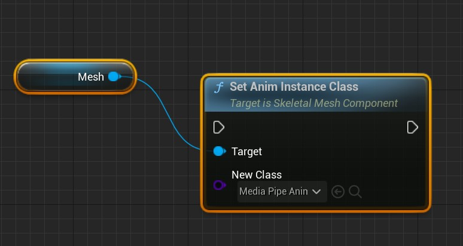
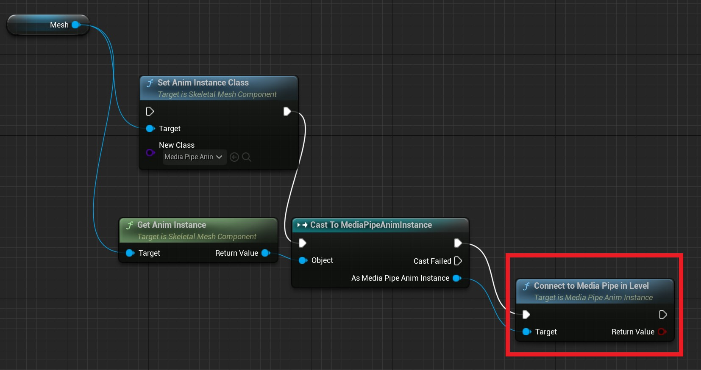

# Switch Animation Blueprints at Runtime

For various reasons, you may need to change the Animation Blueprint on a skeletal mesh after the program is running.    

!!! tip 

    If you need this because the Animation Blueprint base class cannot use `MediaPipeAnimInstance`, do not use the approach described in this document. Instead, consider Unreal Engine's `Animation Blueprint Linking` solution. 
    For `Animation Blueprint Linking`, see the following documentation:

    [https://dev.epicgames.com/documentation/unreal-engine/animation-blueprint-linking-in-unreal-engine](https://dev.epicgames.com/documentation/unreal-engine/animation-blueprint-linking-in-unreal-engine)   


## Key Function

In either Blueprint or C++, you can change a skeletal mesh's Animation Blueprint by setting the `SetAnimInstanceClass` function of `USkeletalMeshComponent`.




## Switch to a MediaPipe Animation Blueprint

When switching to a `MediaPipeAnimInstace` Blueprint, you must also connect the Animation Blueprint to MediaPipe.  

Use the `ConnectToMediaPipeInLevel` function of `MediaPipeAnimInstace` to complete this process:  

>Note: `ConnectToMediaPipeInLevel` returns a bool indicating whether connecting to MediaPipe succeeded.

=== "Blueprint"

    

=== "C++"

    ```cpp
    USkeletalMeshComponent* Mesh = XXXX;
    UClass* AnimInstanceClass = UMediaPipeAnimInstance::StaticClass(); //This should be your Blueprint class
    Mesh->SetAnimInstanceClass(AnimInstanceClass);
    UAnimInstance* AnimInstance = Mesh->GetAnimInstance();
    if(UMediaPipeAnimInstance* MediaPipeAnimInstance = Cast<UMediaPipeAnimInstance>(AnimInstance))
    {
        if(MediaPipeAnimInstance->ConnectToMediaPipeInLevel())
        {
            // switch ok
        }
        else
        {
            // switch fault
        }
    }
    ```
