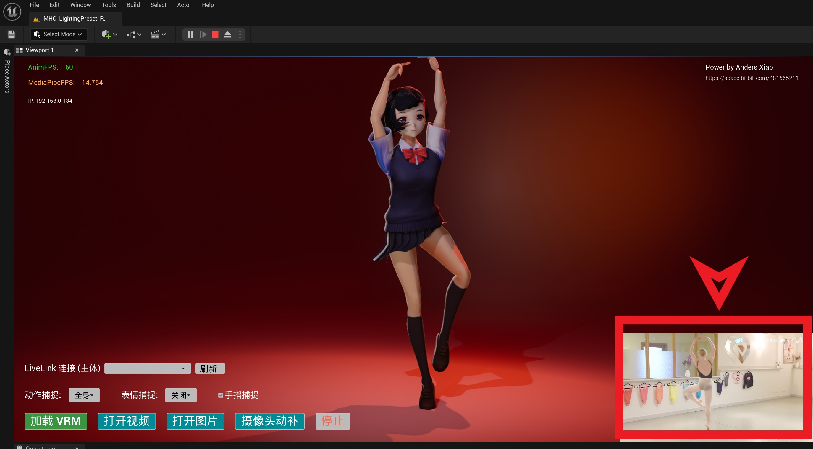
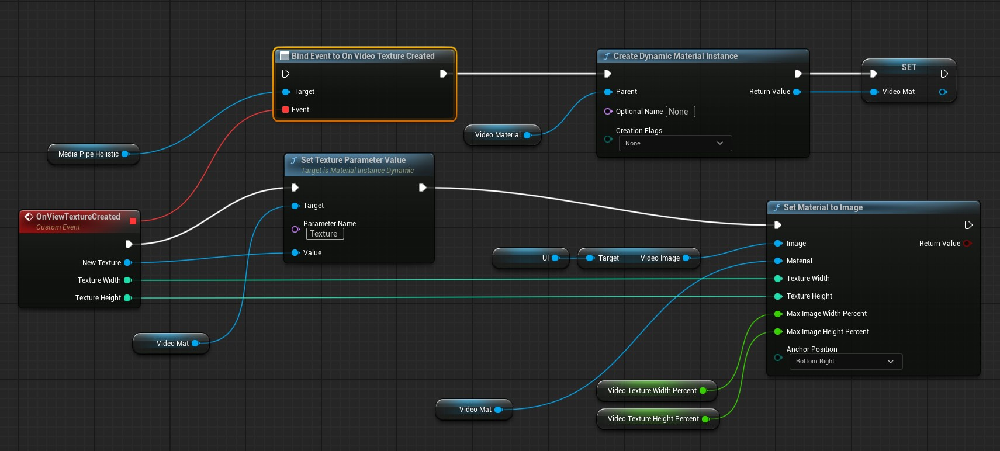
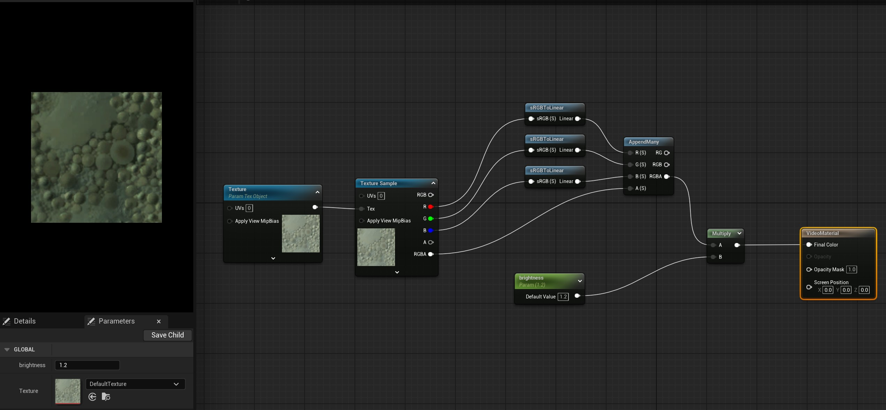
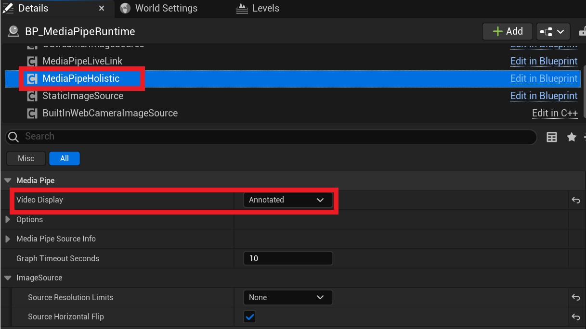
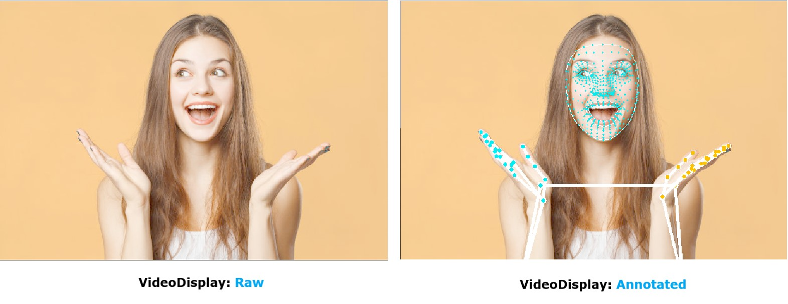

# Display Images

You may want to display images from the image source on screen. MediaPipe4U provides a callback for rendering source images in a material or UMG.



The easiest way to learn how to display tracked images is to watch the introductory tutorial:

- [Youtube](https://youtu.be/_6OLqClX-Fw)   
- [bilibili](https://www.bilibili.com/video/BV1zs4y1978J)   

## Callback Event

`UMediaPipeHolisticComponent` provides the `OnVideoTextureCreated` event. Bind it to receive a `Texture2D` object for rendering.

This event is a multicast delegate (Blueprint event), defined in C++ as:

```c++
DECLARE_DYNAMIC_MULTICAST_DELEGATE_ThreeParams(FOnVideoTextureCreated, UTexture2D*, NewTexture, int, TextureWidth, int, TextureHeight);

UPROPERTY(Category="MediaPipe | VideoTexture", BlueprintAssignable)
FOnVideoTextureCreated OnVideoTextureCreated;
```

> This event is available for video, image, and camera motion capture.

Blueprint example:



The Blueprint above dynamically creates a material in `OnVideoTextureCreated`, sets the material's `Texture` parameter to the callback texture, and assigns the material to a `UImage` in the UI.


For reference, its `VideoMaterial` is defined as follows:



## SetMaterialToImage Function

To simplify drawing images in UMG, `SetMaterialToImage` helps align an image with a corner of a Canvas.   

If you render with a `UImage` inside a Canvas, use this Blueprint function to simplify alignment and automatic scaling.

`SetMaterialToImage` parameters:

This function works only when Image is inside a Canvas.

| Parameter | Type | Description |
|------|-----|------|
|Image| UImage* | Image component in UMG |
|Material| UMaterialInstance* | Material to draw in Image  |
|TextureWidth| int | Image width  |
|TextureHeight| int | Image height  |
|MaxImageWidthPercent| float | 0-1, maximum percentage of Canvas width the image can occupy (1 means 100%)  |
|MaxImageHeightPercent| float | 0-1, maximum percentage of Canvas height the image can occupy (1 means 100%)  |
|AnchorPosition| EAnchorPosition | Image position in the Canvas; values are described below |
   


>**AnchorPosition** values
>
>TopLeft: upper-left corner    
>TopRight: upper-right corner   
>BottomLeft: lower-left corner   
>BottomRight: lower-right corner   
>TopCenter: top center   
>BottomCenter: bottom center   
>MiddleCenter: center

# Display Mode

Set **VideoDisplay** on **UMediaPipeHolisticComponent** to control the display style and show or hide guide lines used to analyze motion-capture data.   


[](images/texture_display/video_display_mode_component.jpg)

The following image shows results produced by different VideoDisplay values:


[](images/texture_display/video_display_mode.jpg)
