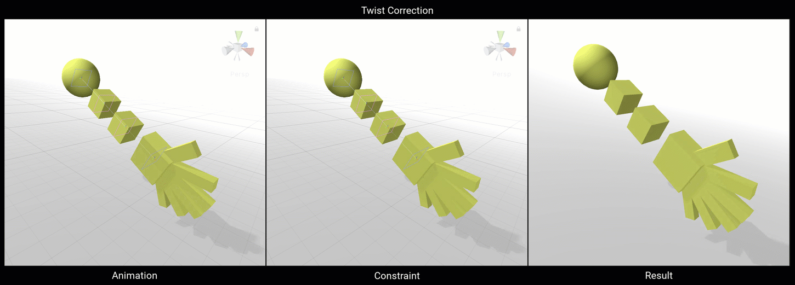
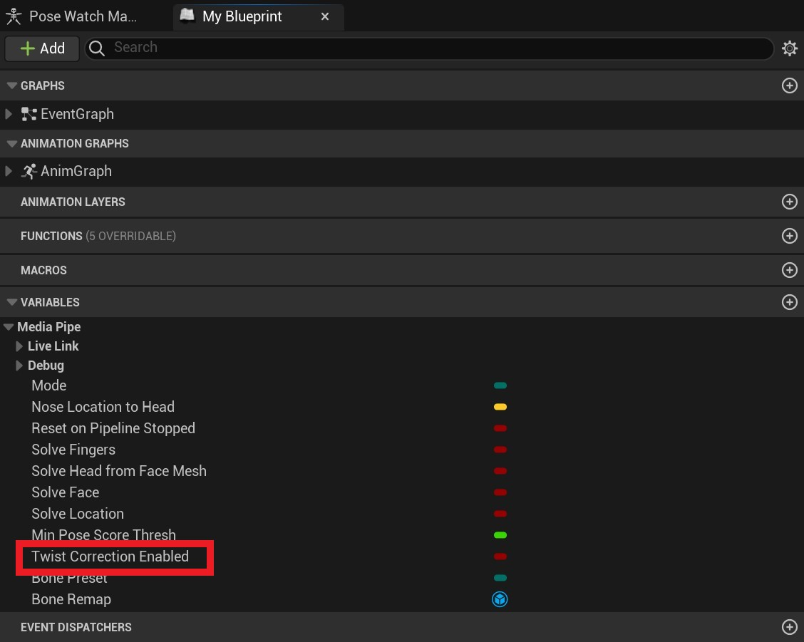
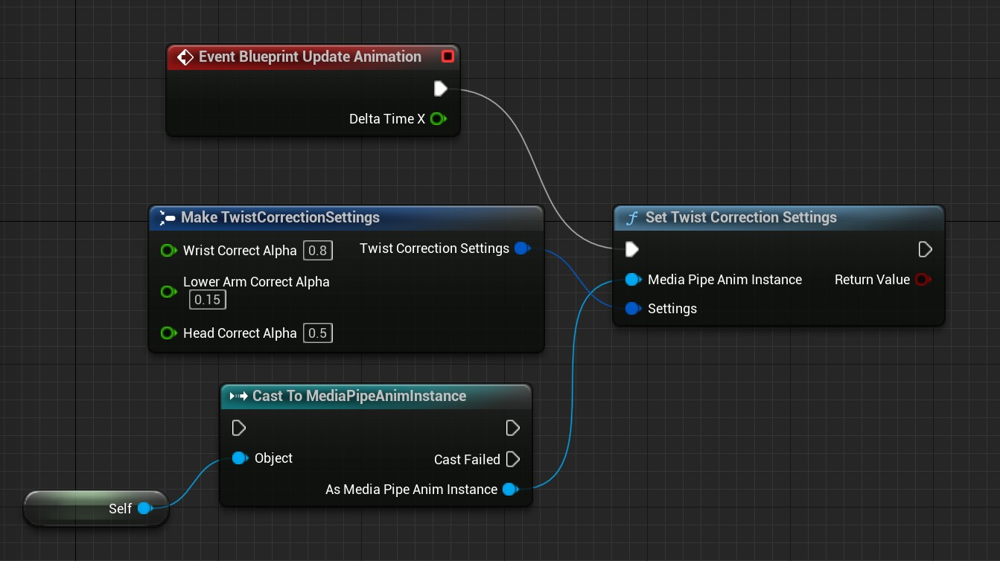
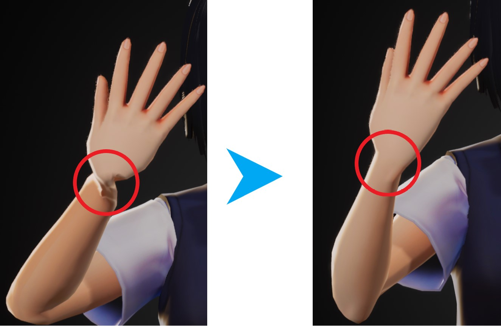
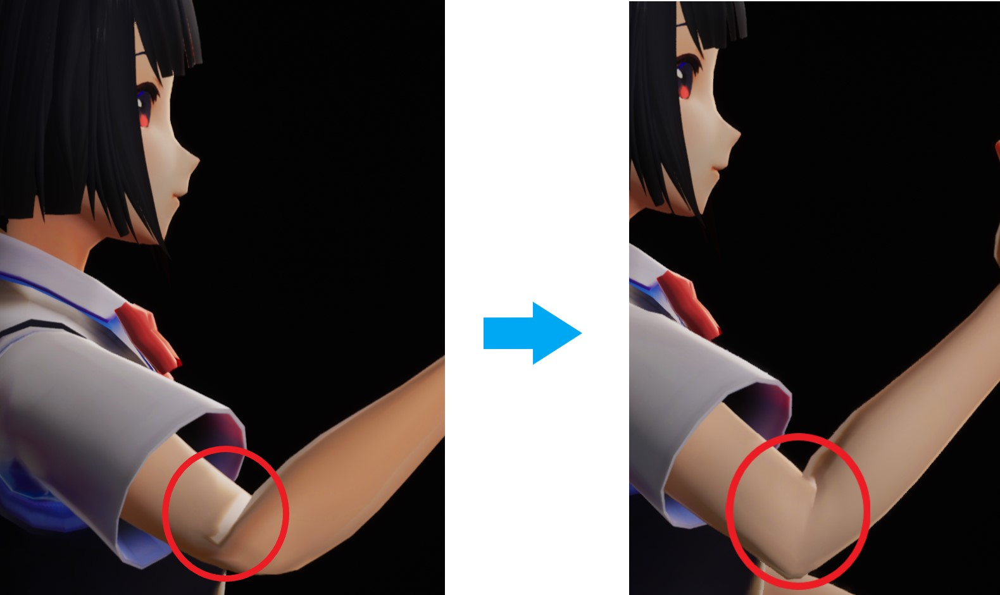
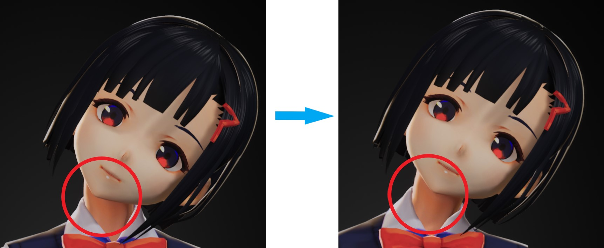

# Joint Twist Correction

## Principle

Twist correction redistributes a percentage of a bone's rotation to its parent bone to correct joint twisting around a rotation axis. When there are **no** dedicated corrective bones or BlendShapes, the plugin's correction algorithm can reduce twisting, but it may introduce twisting in higher-level joints.
In practice, it distributes the twist along the joint chain to reduce excessive twisting at the end joint.    

!!! tip

    If dedicated corrective bones are available, disable the plugin's correction algorithm (set `Enabled` in `TwistCorrectionSettings` to **false**) and handle joint twisting in a post-process Animation Blueprint.

The following animation illustrates twist correction:

[](images/twist_correction/twist_correction.gif)

Twist correction in `MediaPipe4U` covers the wrists, elbows, and head:   

- Wrist Correct: Corrects the wrist (Hand) using the forearm (LowerArm).
- Lower Arm Correct: Corrects the forearm (Lower Arm) using the upper arm (UpperArm).
- Head Correct: Corrects the head (Head) using its parent bone, usually the neck (Neck).    


> Correction parameters (weights) can be retrieved in both Blueprint and C++, and dynamically adjusted at runtime.

## Enable Twist Correction

Twist correction is disabled by default. Enable it by setting **TwistCorrectionEnabled** on **MediaPipeAnimInstance** to **true**.   

[](images/twist_correction/twist_enable.gif)


## Set Correction Weights in Blueprint  

MediaPipe4U supports dynamically adjusting joint twist-correction weights at runtime, which is useful while tuning a model.

=== "Blueprint"

    [](images/twist_correction/update_settings.jpg)

=== "C++"

    ```c++
    FTwistCorrectionSettings settings;
    settings.HeadCorrectAlpha = 0.5f;
    settings.WristCorrectAlpha = 0.85f;
    settings.LowerArmCorrectAlpha = 0.15f;
    UMediaPipeMotionUtils::SetTwistCorrectionSettings(animInstance, settings);
    
    ```

## Correction Properties

|Property|Default|Description|
|-----|----|------|
|HeadCorrectAlpha|0.5| A value from 0 to 1 representing the rotation weight of the head-correction bone around the axis. It corrects head rotation in the Roll direction only. |
|WristCorrectAlpha|0.85| A value from 0 to 1 representing the rotation weight of the wrist-correction bone (Lower Arm by default) around the axis. |
|LowerArmCorrectAlpha|0.15| A value from 0 to 1 representing the rotation weight of the elbow-correction bone (Upper Arm) around the axis. |

!!! tip

    Although a parent bone can correct twisting, it may introduce twisting in higher-level bones. Keep correction values as small as possible.

**Wrist Correction Result**

[](images/wirst_correction.jpg)

**Elbow Correction Result**

[](images/lower_arm_correction.jpg)

**Head Correction Result**

[](images/head_correction.jpg)
