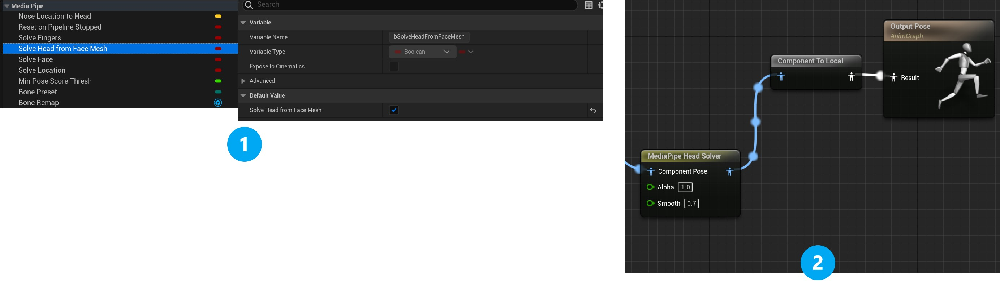

# Head Solver

Normally, **MediaPipe4U** uses the 33 landmarks in MediaPipe Holistic to calculate a 3D model's pose in real time. However, MediaPipe Holistic cannot obtain accurate head rotation in scenes with close-up facial shots.
For this purpose, **MediaPipe4U** provides an independent head solver. It uses facial landmarks from MediaPipe Face Mesh to calculate head rotation, enabling more accurate head-motion data.

## Limitations

The solver works only when MediaPipe Face Mesh can obtain clear landmarks. Therefore, the head solver is suitable only for scenes with close-up facial shots in camera or video input (the upper-body live-streaming mode meets this condition).

## How to Use

To use the head solver, complete the following steps:

1. In the Animation Blueprint (inherited from **MediaPipeAnimInstance**), set the **SolveHeadFromFaceMesh** variable to true.
2. Add a **MediaPipeHeadSolver** node to the Animation Blueprint.

   

