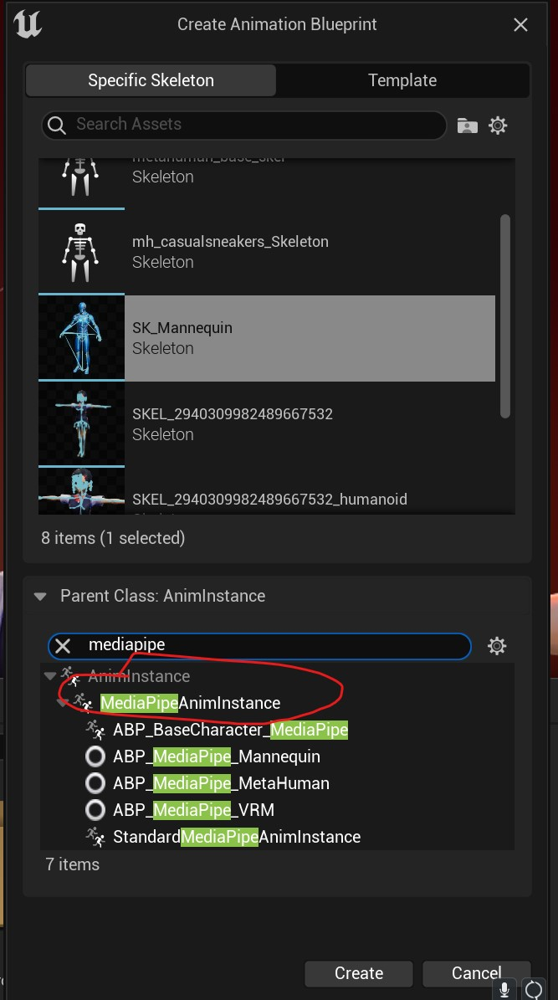
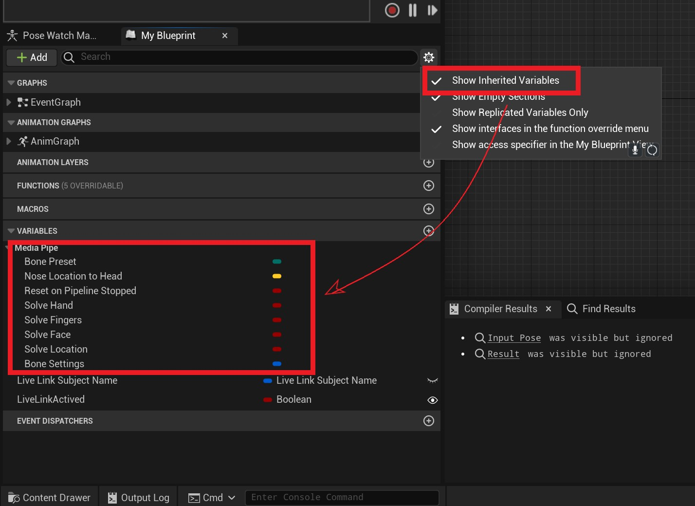
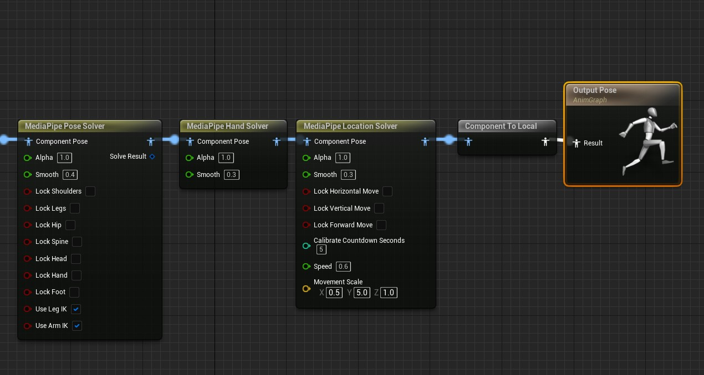
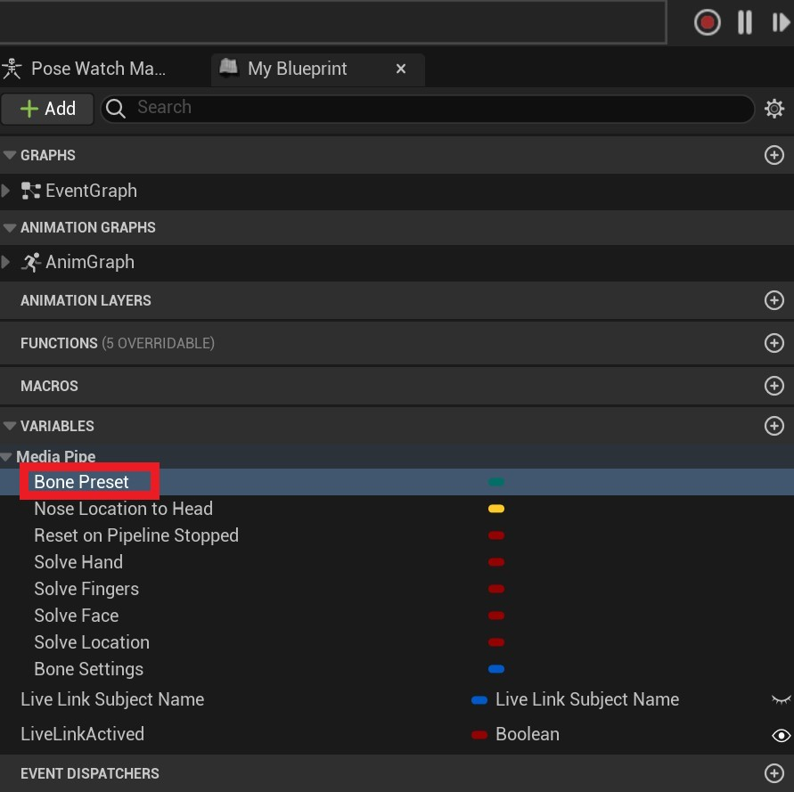

# Prepare a Motion-Capture Character

## Create an Animation Blueprint

1. Create an Animation Blueprint based on MediaPipeAnimInstance.

Select MediaPipeAnimInstance as the base class!   
Select MediaPipeAnimInstance as the base class!   
Select MediaPipeAnimInstance as the base class!   

It is important enough to repeat three times.

> This base class is required for motion capture to work correctly.   

1. In the left pane of the Animation Blueprint, enable inherited-variable visibility so that the MediaPipe variables are shown.   

3. Add these three nodes in order: MediaPipePoseSolver, MediaPipeHandSolver, MediaPipeLocationSolver.   

   

--- 

## Core Animation Blueprint Nodes   

### MediaPipePoseSolver

The body-motion solver node calculates body-bone rotations. Parameters:   

|Parameter|Type|Description|
|---|----|-----|
Alpha     | float (0-1.0)      | Same as Alpha on ordinary Animation Blueprint nodes; see the UE documentation
Smooth     | float (0-1.0)     | Motion smoothing for the damping filter. Higher values reduce jitter but reduce responsiveness. Use lower values for fast motion such as street dance, and higher values to remove jitter from slower motion
|LockShoudlers| bool | Locks the bone chain from the shoulders to the wrists. When **true**, bones in the chain do not participate in motion capture. "Lock" has the same meaning below. |
|LockLegs| bool | Locks the chain from the thighs to the feet. |
|LockHips| bool | Locks the pelvis. Because it is usually the root bone, locking it prevents whole-body rotation. |
|LockSpine| bool | Locks the spine, preventing upper-body rotation. |
|LockChest| bool | Locks the chest. **Note**: the chest is also locked when LockSpine is **true**. |
|LockHead| bool | Locks the head, preventing head rotation. |
|LockHand| bool | Locks wrists and fingers. **Note**: locking LockShoudlers also forces the hands to lock. |
|LockKnee| bool | Locks the knees. **Note**: locking LockLegs also forces the knees to lock. |
|LockFoot| bool | Locks the ankles. **Note**: locking LockLegs also forces the ankles to lock. |
|UseLegIK| bool | Uses leg IK to correct knee twisting. Normally enabled, although motion may be less exact than with IK disabled. |
|UseArmIK| bool | Uses arm IK to correct elbow twisting. Normally enabled, although motion may be less exact than with IK disabled. |
|KalmanQ| float | Kalman filter Q parameter; do not change unless familiar with Kalman filtering. |
|KalmanR| float | Kalman filter R parameter; do not change unless familiar with Kalman filtering. |
|Optimize| bool | Performs additional optimization to adjust unreasonable joint rotations. Disable it if optimization causes pose problems. |

> KalmanQ and KalmanR are not shown as pins by default because they are rarely used, but are available in Details.

### MediaPipeHandSolver   

The finger-motion solver calculates finger-bone rotations and uses the same parameters as **MediaPipePoseSolver**.

### MediaPipeLocationSolver

The motion-capture location solver calculates character translation. Shared parameters are omitted:   

|Parameter|Type|Description|
|---|----|-----|
|LockHozantalMove| bool | Locks horizontal movement (left/right). |
|LockVerticalMove| bool | Locks vertical movement (crouching/jumping). |
|LockForwardMove| bool | Locks forward/backward movement. |
|CalibrateCountDownSeconds| float | Delay in seconds before automatic location calibration. The character does not move before calibration. |
|Speed | float | Character movement speed. Translation is estimated using an inertia-like method rather than absolute spatial positioning. Adjust this to match the source-motion speed. |
|MovementScale | FVector | Scales movement on the character's X, Y, and Z axes, allowing per-axis control. |
   

--- 

## Animation Blueprint Parameters

Find MediaPipeAnimInstance parameters in the MediaPipe category of the Animation Blueprint's left tab.

   

|Parameter (Variable)| Default|Description |
|-------|--------|---------------------------------|
|BonePreset| UE5 |Skeleton preset to use. |
|BoneRemap| NULL |Custom skeleton-remapping asset; see [**Custom Skeletons**](./custom_skeleton.md). Effective only when **BonePreset** is Custom.|
|ResetOnPiplineStop|true|Whether to reset character-bone rotations when MediaPipe stops.|
|MinPoseScoreThresh|0.5|Joint-solving threshold from 0 to 1. A joint is calculated only when its score exceeds this value.|
|SolveFingers|true|Whether to solve finger motion; requires MediaPipe Hand Solver. When enabled, wrist rotation uses more accurate MediaPipe Hand landmarks; otherwise it uses MediaPipe Pose landmarks.|
|SolveLocation|true|Whether to solve translation.|
|TwistCorrectionEnabled|false|Whether to enable joint twist correction; see [twist correction](../advance/twist_correction.md).|
|SolveHeadFromFaceMesh|false|Whether to solve head rotation from FaceMesh landmarks. When disabled, MediaPipe Pose landmarks are used.|
|LiveLinkSubject||A convenience preset you may use or ignore; MediaPipe4U does not use it. |
|LiveLinkEnabled|true|A convenience preset you may use or ignore; MediaPipe4U does not use it. |

   
> Note: If **SolveFingers** is **true** but **LockHand** is **true** on MediaPipe Pose Solver, fingers are not solved.   

---   
## Skeleton Binding

MediaPipe4U theoretically supports any humanoid skeleton without requiring a naming convention. The following presets reduce manual configuration.   

Select a preset with **BonePreset**:   

- UE5: UE5 Mannequin skeleton, also compatible with UE4 Mannequin and Metahuman
- VRoid (VRM): VRM model skeletons made with VRoid Studio
- CharacterCreator: Standard CharacterCreator 3/4 character skeletons
- Custom: Custom skeleton, described in the next section

---

The **MediaPipe4U** character is now ready. Continue to the following sections.
