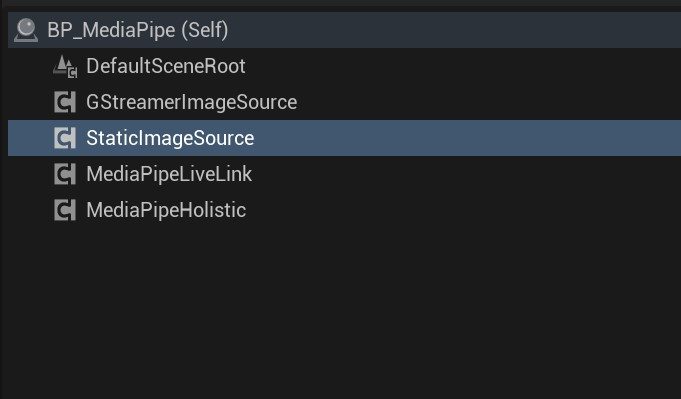

# Prepare Runtime Components

**MediaPipe4U** requires several runtime components, described below: 

## UMediaPipeImageSource Interface

When using video or image motion capture, **MediaPipe4U** needs an image source for the MediaPipe workflow. **MediaPipe4U** abstracts this image source through the
**UMediaPipeImageSource** interface. This is a standard UE interface, so you can implement it in Blueprint or C++. It provides MediaPipe with the image data required for AI computation.   

*Implementing this interface as a Component is recommended for flexible use in the Editor.*   

 
> Note: The implementation must ensure multithreaded performance, for example by using an image-buffer queue; otherwise, the entire solver may perform poorly. Implement the interface efficiently in C++. For example, obtain images from UE's built-in media player and feed them into MediaPipe, or obtain images from an online video stream.

**MediaPipe4U** provides two common built-in implementations for convenient image and video motion capture.

---

## StaticImageSouceComponent

A static-image source that completes the solving process by sending a single image to MediaPipe.   
> Note: A single image automatically enables MediaPipe's static mode and optimizes the solving process. Do not implement single-image motion capture yourself; use this component.

## GStreamerImageSourceComponent    
   

>This component requires the GStreamer Plugin.  

This GStreamer image source obtains a video stream from GStreamer and uses it as an image source.   
GStreamerImageSourceComponent can be treated as a video player, providing playback, pause, seeking, and related capabilities.

> GStreamer is a well-known third-party media library that supports capture, encoding, decoding, and rendering. See https://gstreamer.freedesktop.org/ if you are interested in GStreamer. GStreamer is used for full MP4 compatibility; if you are familiar with it, you can even decode online media streams and output them to MediaPipe for motion capture.

<small>GStreamer source code is licensed under the LGPL. The MediaPipe4U plugin does not modify GStreamer, so it can be used commercially and redistributed without copyright concerns. If you modify GStreamer to implement advanced features, comply with the LGPL to respect intellectual property rights and avoid disputes involving your commercial software.</small>

## MediaPipeHolisticComponent

A component that wraps the MediaPipe Holistic Calculator. For information about MediaPipe Holistic, see:

https://google.github.io/mediapipe/solutions/holistic.html

## Create an Actor

Create an Actor and add the components above. The Actor should look like this:

   

You have now completed all preparations required to run **MediaPipe4U** motion capture. 

!!! note "Tip"

    This is a basic quick-start tutorial and does not cover facial-expression capture.   
    To capture facial expressions from an image source, read the [facial-expression capture documentation](../features/face_link_actor.md).
