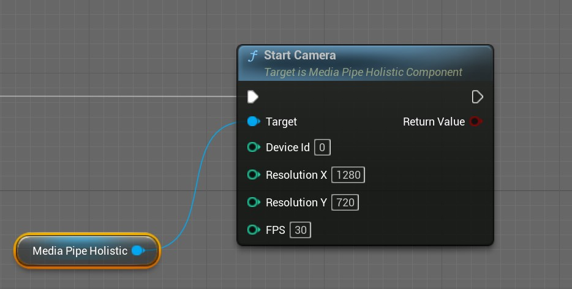
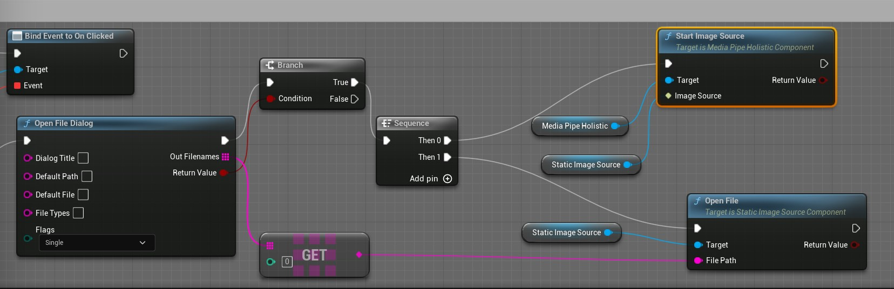
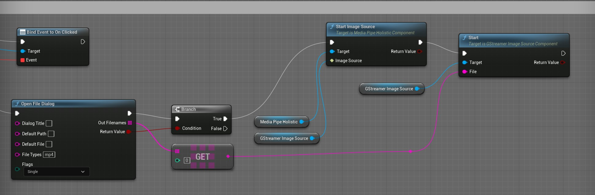
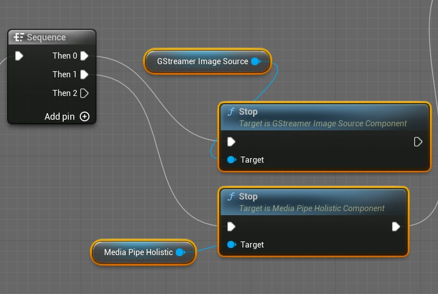

# Start Motion Capture

## Camera Motion Capture

Call the **StartCamera** function of **MediaPipeHolisticComponent** to start camera motion capture. When called from Blueprint, it looks roughly like this:

   

StartCamera parameter description

|Parameter|Description|
|-------------|----------------|
|DeviceId|Camera ID; usually, 0 represents the first camera on the PC|
|ResolutionX |Horizontal camera resolution|
|ResolutionY |Vertical camera resolution|

> Note: Cameras generally support many resolutions. Larger images are not always better; overly large images reduce computational efficiency. 1280*720 is recommended.

## Image Motion Capture

Call the **StartImageSource** function of **MediaPipeHolisticComponent**, passing in StaticImageSouceComponent. The method is straightforward, so refer to the Blueprint node below:

   

## Video Motion Capture

Call the **StartImageSource** function of **MediaPipeHolisticComponent**, passing in GStreamerImageSourceComponent:   

> After starting MediaPipe, also call the **Start** function of **GStreamerImageSource** to begin video playback.

   

## Stop Motion Capture

Call the **Stop** function of **MediaPipeHolisticComponent**. Pass GStreamerImageSourceComponent to StartImageSource:   
> After stopping MediaPipe, also stop GStreamerImageSource playback (call the **Stop** function of **GStreamerImageSource**).

   
